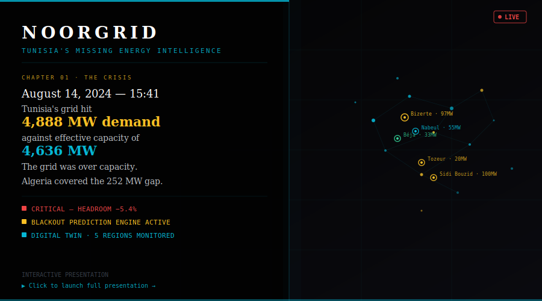

# NoorGrid ⚡
### Tunisia's Renewable Energy Intelligence Platform

> *"There is no digital follow-up system for these grids. And there is no prevention mindset."*
> — Senior Official, STEG Renewable Energy Division, April 2026

---
## Presentation

[](https://publisherx02.github.io/NoorGrid/presentation.html)


---
## The Problem

On **August 14, 2024 at 15:41**, Tunisia's national grid hit a record **4,888 MW of demand** against an effective capacity of **4,636 MW**. The grid was over capacity by 252 MW. Algeria covered the gap through the Transmed interconnector. Without that intervention, Tunisia faced a cascading blackout affecting 12 million people.

This is not a hypothetical. It happens every summer.

Today, **93.7% of Tunisia's electricity comes from fossil fuels**. Renewables account for only **6% of 19,395 GWh** generated in 2024. Grid losses reached **22%**. Energy independence collapsed from **48% in 2023 to 41% in 2024**.

Tunisia has wind farms, solar plants, and hydroelectric dams scattered across 24 governorates. Each installation is monitored in isolation. There is no centralized real-time view. There is no prediction. There is no prevention.

**NoorGrid fixes that.**

---

## What NoorGrid Is

NoorGrid is Tunisia's first intelligent renewable energy operating system — a B2G SaaS platform built for STEG operators and the Ministry of Energy. It provides a real-time digital twin of Tunisia's national grid, a 72-hour blackout prediction engine, an AI-powered operations advisor, and an interactive simulation console — all in a single unified interface.

---

## Architecture Overview

```
Physical World
  Wind Turbine Sensors · Solar Panel Arrays · Dam Flow Meters · Smart Grid Meters
          ↓
Data Layer
  OpenMeteo API (live weather, free) · STEG billing data · SQLite history store
          ↓
FastAPI Backend  (localhost:8000)
  Energy calculations · Blackout prediction · Grid simulation · RAG query endpoint
          ↓
React Ops Dashboard  (localhost:3000)
  Live map · Risk scoring · Simulation console · RAG chatbot · Analytics
          ↓
Intelligence Layer
  NVIDIA NIM — Meta Llama 3.1 70B Instruct (RAG chatbot)
  Composite risk scoring · Trend detection · Regional correlation
```

---

## Verified 2024 Grid Constants

Source: ONEM National Energy Balance 2024 · World Bank TEREG Program · STEG Annual Report 2024

| Metric | Value |
|--------|-------|
| Total installed capacity | 5,944 MW (25 plants) |
| Effective capacity | 4,636 MW (after 22% losses) |
| Grid losses | 22% (technical + non-technical) |
| Natural gas share | 93.7% of generation |
| Renewables share | 6.0% of 19,395 GWh |
| Record peak demand | 4,888 MW — Aug 14, 2024 at 15:41 TUN |
| Algeria import dependency | 14% of Q3 2024 peak demand |
| Algeria deficit (Aug 14) | 252 MW via Transmed HVDC |
| Energy independence | 41% (down from 48% in 2023) |
| Population | 11,800,000 |
| Grid emission factor | 0.468 kg CO₂ / kWh |

---

## Mathematical Models

All formulas are implemented in `backend/calculations.py` and mirrored in the frontend simulation engine.

### Wind Power

```
P_wind = 0.5 × ρ × A × v³ × η
```

| Variable | Value |
|----------|-------|
| ρ | 1.225 kg/m³ (air density at sea level) |
| A | Rotor swept area in m² (per installation) |
| v | Wind speed from OpenMeteo in m/s |
| η | Turbine efficiency (0.40) |

**Bizerte reference:** 7,854 m² rotor area, 8.2 m/s avg → 97 MW baseline

### Solar Power

```
P_solar = G × A × η
```

| Variable | Value |
|----------|-------|
| G | Solar irradiance from OpenMeteo in W/m² |
| A | Total panel area in m² |
| η | Panel efficiency (0.18) |

Output is forced to 0 MW between 20:00–06:00 TUN (physics constraint).

**Sidi Bouzid reference:** 600,000 m² panel area, 750 W/m² → 100 MW baseline

### Hydro Power

```
P_hydro = ρ_w × g × Q × H × η
```

| Variable | Value |
|----------|-------|
| ρ_w | 1,000 kg/m³ |
| g | 9.81 m/s² |
| Q | Flow rate in m³/s |
| H | Head height in metres |
| η | Turbine efficiency (0.88) |

**Béja reference (Sidi Salem Dam):** 33 MW seasonal baseline, Oct–Apr operation.

### Carbon Score

```
C_region = (E_consumed − E_renewable) × 0.468  [kg CO₂]

National Carbon Index = Σ C_region / 11,800,000  [kg CO₂ / capita / day]
```

- `E_consumed` from STEG billing data
- `E_renewable` from live weather calculations
- 0.468 = Tunisia grid emission factor (kg CO₂/kWh, STEG 2024)
- Current national index: **2.31 kg CO₂/cap/day** → target **1.80 by 2030**

### Blackout Risk Engine (Prediction)

```
cooling_surge = max(0, (temperature_c − 25) × 0.08)
peak_factor   = 1.05 if hour in [08:00–19:00] else 1.0
demand_est    = baseline_mw × (1 + cooling_surge) × peak_factor

stress_ratio        = demand_est / max(available_mw, 1.0)
blackout_probability = min(100, max(0, (stress_ratio − 1) × 25))
```

| Stress Ratio | Risk Level | Action |
|-------------|------------|--------|
| > 4.0 | CRITICAL | Emergency load shedding + Algeria import |
| > 2.5 | HIGH | Activate reserve, reduce industrial load |
| > 1.5 | ELEVATED | Monitor closely, prepare demand response |
| ≤ 1.5 | NOMINAL | No action required |

### National Grid Simulation Model

```
cooling_surge   = max(0, (temperature_c − 25) × 0.04)
base_demand     = Q3_AVG_DEMAND_MW × (1 + cooling_surge) × peak_hour_factor
total_demand    = base_demand × (1 + demand_delta_pct / 100)

total_available = EFFECTIVE_CAPACITY_MW + reserve_capacity_mw
deficit         = max(0, total_demand − total_available)
import_required = deficit
headroom_pct    = (total_available − total_demand) / total_available × 100
```

### Composite Risk Score (Ops Dashboard)

```
Risk Score = 0.40 × DemandStress
           + 0.25 × TemperatureDeviation
           + 0.20 × RateOfChange
           + 0.15 × RegionalCorrelation
```

All components normalized to 0–100:

| Score | Risk Level |
|-------|------------|
| 0–24 | NOMINAL |
| 25–49 | ELEVATED |
| 50–74 | HIGH |
| 75–100 | CRITICAL |

- **DemandStress**: (demand / capacity) ratio, primary driver
- **TemperatureDeviation**: delta from 25°C baseline × cooling surge multiplier
- **RateOfChange**: MW/hour acceleration — detects runaway demand spikes
- **RegionalCorrelation**: simultaneous HIGH+ across 3+ governorates

---

## Monitored Installations

| Governorate | Source | Baseline | Installed Cap. | Real Installation |
|-------------|--------|----------|----------------|-------------------|
| Bizerte | Wind | 97 MW | 120 MW | Métline + Kchabta Wind Farms |
| Nabeul | Wind | 55 MW | 75 MW | Sidi Daoud Wind Station |
| Tozeur | Solar | 20 MW | 25 MW | Centrale PV Tozeur |
| Béja | Hydro | 33 MW | 40 MW | Sidi Salem Dam |
| Sidi Bouzid | Solar | 100 MW | 130 MW | Mazouna/Al-Khabna Solar |

The remaining 19 governorates are modelled with simulated data derived from regional weather and installed capacity estimates.

---

## React Frontend — Five Pages

The production-grade React 18 frontend runs on Vite + Tailwind CSS with a dark ops-room aesthetic (`#0a0f1a` background, `#00ff88` accent, JetBrains Mono for all numeric data).

### 1. Landing Page

Marketing and pitch page targeting STEG decision-makers:

- Canvas particle background with mouse repulsion physics
- Live stats bar: 5,944 MW capacity, 24 governorates, 72h forecast, 6% renewable, 4,888 MW record peak
- Three feature cards: Digital Twin, Blackout Prediction, Carbon Index
- STEG testimonial quote block
- Technology partner row: OpenMeteo, NVIDIA NIM, FastAPI, STEG

### 2. Dashboard — Live Ops Room

A fixed-viewport three-panel operations center (`height: 100vh; overflow: hidden`). No scrolling — everything the operator needs is visible simultaneously.

**Top bar (40px):**
- NoorGrid logo + LIVE pulse indicator
- SIMULATED DATA banner when backend is offline
- Real-time service health pills: Backend, Weather API, Prediction Engine
- Quick navigation to Analytics, Simulation, About

**Left panel (220px):**
- Tunisia clock (Africa/Tunis timezone, live seconds)
- Grid Overview: Total Output (MW), Active Anomalies, National Carbon Index
- Governorate selector grouped by risk level — CRITICAL first, then HIGH, then NOMINAL/ELEVATED
- Live risk from the prediction API overrides mock data (the "liveRiskMap" pattern)

**Center panel (flex):**
- Interactive Leaflet.js map (CartoDB Dark Matter tiles)
- Custom DivIcon markers with glow and pulse animation on CRITICAL/HIGH
- Marker risk color updates in real time from `liveRiskMap`
- Clicking a governorate triggers a `/predict/blackout` API call and pans the map
- Bottom stats bar: Capacity, Record Peak, Grid Losses, Algeria Buffer, Renewable Share

**Right panel (260px):**
- Gov Cards grid: top 6 at-risk governorates with live risk badges
- Demand vs Output mini bar chart (Recharts)
- **GovernorateStats widget** (shown when a governorate is selected):
  - Energy source type with color-coded icon (Wind=cyan, Solar=gold, Hydro=blue, Mixed=green)
  - 4-cell grid: Live Output, Installed Capacity, Avg Demand, Peak Demand
  - Output vs Avg Demand progress bar (green ≥ 100%, risk color when below)
  - Capacity Utilization bar in source color
- Blackout Prediction peak window: time, probability %, temperature, stress ratio, prevention action
- National Carbon Index semicircular SVG gauge (custom, not a library)
- Quick navigation buttons

**Floating RAG Chatbot widget:**
- Fixed `◈` button (bottom-right, z-index 1001)
- Expands to a 360×460px chat panel
- Context-aware: passes `selectedGov` to the LLM

### 3. Analytics Page

Deep historical analysis for the five backend-connected governorates:

- Tab navigation per governorate
- 48H Area Chart: renewable output (MW) + wind speed (m/s) dual-axis
- Risk Breakdown Bar Chart (3 components: Deviation, Rate-of-Change, Regional Correlation)
- Historical data table with timestamp and all weather fields
- CSV export button

### 4. Simulation Console

Interactive national grid stress testing:

**Left column — Controls:**
- Demand Delta slider: −20% to +50%
- Temperature slider: 15°C to 55°C (color shifts green→orange→red at thresholds)
- Renewable Output slider: 0–800 MW
- Reserve Capacity slider: 0–1,000 MW
- Peak Hour Factor toggle (animated pill switch)
- Risk score card with live gauge bar and recommended action

**Right column — Results:**
- 6-cell metrics grid: Total Demand, Effective Capacity, Headroom, Import Required, Renewable Share, Temperature
- 24-hour Demand vs Capacity Area Chart (Recharts) with demand, capacity ceiling, and renewable overlay
- Demand Model Drivers breakdown: Seasonal Base, Cooling Surge, Peak Factor, Demand Δ, Reserve, Temperature
- **STEG RAG Chatbot** (520px, context-injected with live simulation state)

**Aug 14, 2024 Replay:**
- One-click replay button sets parameters to the exact crisis conditions (45°C, +20% demand, 280 MW renewable)
- Red alert banner with crisis description
- Chatbot automatically has access to the replay context

### 5. About / Pitch Page

Investor and stakeholder pitch:

- Problem statistics cards with live-calculated numbers
- Full STEG testimonial quote block with gradient accent border
- Solution architecture: three numbered pillars (Digital Twin, Prediction Engine, Carbon Index)
- Team section
- GitHub and API documentation links
- Contact form with success state

---

## STEG RAG Chatbot

A fully interactive AI chatbot powered by **NVIDIA NIM — Meta Llama 3.1 70B Instruct**, embedded directly in the simulation console and available as a floating widget on the dashboard.

### How it works

```
User query
    → POST /rag/query  { message, context }
    → FastAPI builds system prompt with STEG knowledge + live grid state
    → NVIDIA NIM API  (integrate.api.nvidia.com/v1/chat/completions)
    → meta/llama-3.1-70b-instruct  (temperature 0.25, max_tokens 700)
    → Response streamed character-by-character in the UI
```

### System prompt design

The LLM receives a 500-word system prompt that:

1. Defines its persona as a senior STEG grid engineer
2. Lists all knowledge domains (capacity specs, Aug 14 crisis, renewable resources, Transmed interconnector, blackout risk methodology, maintenance schedules, investment pipeline, carbon/NDC data)
3. Injects live grid context from the frontend (active simulation risk level, demand, headroom, selected governorate, replay mode)
4. Enforces strict domain guardrails: off-topic queries (sports, politics, cooking, personal questions) receive a single-sentence rejection

### Context injection

When a user has the simulation running or a governorate selected, the LLM receives this alongside their question:

```
CURRENT PLATFORM STATE:
  Risk level     : HIGH  (score 64/100)
  Total demand   : 4,521 MW
  Headroom       : +2.5%
  Temperature    : 41°C
  Recommended    : PRE-AUTHORIZE ALGERIA IMPORT...

SELECTED GOVERNORATE: Sfax (Centre-East)
  Energy source  : Mixed
  Live output    : 245 MW
  Risk status    : ELEVATED
```

This means asking *"what should I do right now?"* gets a real answer grounded in the live dashboard state, not a generic response.

### UI features

- Message history with user bubbles (right, green-tinted) and AI bubbles (left, monospace dark card)
- Per-line syntax highlighting: ALL-CAPS section headers → cyan, critical keywords → red, positive indicators → green
- Streaming text animation (5 chars/tick) with blinking cursor
- 3-dot typing indicator while the LLM generates
- Suggested quick questions on empty state
- Error states with distinct red styling and actionable error messages (no fake "AI" fallback)

---

## Backend API Reference

| Method | Path | Description |
|--------|------|-------------|
| GET | `/health` | Service health check |
| GET | `/weather` | Live weather for all 5 governorates + auto-persist to SQLite |
| POST | `/energy/wind` | Wind power output in MW |
| POST | `/energy/solar` | Solar power output in MW |
| POST | `/energy/hydro` | Hydro power output in MW |
| POST | `/energy/carbon` | Carbon score in kg CO₂ |
| GET | `/history/{region}?days=N` | Historical weather records (1–365 days) |
| POST | `/history/record` | Manual weather snapshot insertion |
| POST | `/grid/simulate` | National demand/capacity/import simulation |
| POST | `/predict/blackout` | 72h blackout risk forecast with hourly predictions |
| POST | `/rag/query` | STEG RAG chatbot via NVIDIA NIM LLM |

Interactive docs: `http://localhost:8000/docs`

### Example: Grid simulation

```bash
curl -X POST http://localhost:8000/grid/simulate \
  -H "Content-Type: application/json" \
  -d '{
    "renewable_output_mw": 320,
    "demand_delta_pct": 15,
    "temperature_c": 41,
    "include_peak_hour_factor": true,
    "reserve_capacity_mw": 200
  }'
```

```json
{
  "total_demand_mw": 4502.3,
  "effective_capacity_mw": 4836,
  "headroom_pct": 7.4,
  "risk_level": "HIGH",
  "risk_score": 61.2,
  "import_required_mw": 0,
  "renewable_share_pct": 7.1,
  "recommended_action": "PRE-AUTHORIZE ALGERIA IMPORT..."
}
```

### Example: Blackout prediction

```bash
curl -X POST http://localhost:8000/predict/blackout \
  -H "Content-Type: application/json" \
  -d '{"region": "Bizerte", "forecast_hours": 24}'
```

Returns 24 hourly predictions, each with: `time_label`, `temperature`, `estimated_demand_mw`, `available_mw`, `stress_ratio`, `risk_level`, `blackout_probability`, `prevention_action`.

### Example: RAG query

```bash
curl -X POST http://localhost:8000/rag/query \
  -H "Content-Type: application/json" \
  -d '{
    "message": "What caused the August 14 crisis and how do we prevent it?",
    "context": {}
  }'
```

---

## Historical Data Storage

NoorGrid persists every weather snapshot to SQLite, enabling trend analysis.

- Default path: `data/noorgrid.db`
- Auto-created on first backend startup via `init_db()`
- Every `/weather` call saves one row per governorate
- Query via `GET /history/{region}?days=N` (1–365 days)

**Schema:** `weather_history(id, region, latitude, longitude, wind_speed_ms, solar_irradiance_wm2, recorded_at)`

---

## Tech Stack

### Backend
| Library | Version | Purpose |
|---------|---------|---------|
| FastAPI | 0.115 | REST API framework |
| Uvicorn | 0.34 | ASGI server |
| httpx | 0.28 | Async HTTP (OpenMeteo + NVIDIA NIM) |
| Pydantic | 2.11 | Request/response validation |
| python-dotenv | 1.0.1 | `.env` loading |
| SQLite | stdlib | Historical data persistence |

### React Frontend
| Library | Version | Purpose |
|---------|---------|---------|
| React | 18.3 | UI framework |
| React Router | 6.27 | Client-side routing |
| Vite | 5.4 | Build tool + dev server |
| Tailwind CSS | 3.4 | Utility-first styling |
| Leaflet.js | 1.9 | Interactive map (imperative, not react-leaflet) |
| Recharts | 2.13 | Area, bar, radial charts |
| Axios | 1.7 | HTTP client with mock fallback pattern |

### Design System
- Background: `#0a0f1a`
- Accent green: `#00ff88`
- Secondary cyan: `#06b6d4`
- Alert red: `#ff3333`
- Warning orange: `#ff9500`
- Typography: Inter (UI) + JetBrains Mono (all numeric/data values)

---

## Project Structure

```
NoorGrid/
├── backend/
│   ├── main.py           # FastAPI app, all endpoints including /rag/query
│   ├── models.py         # Pydantic request/response models
│   ├── calculations.py   # Wind, solar, hydro, carbon formulas
│   ├── grid.py           # National grid simulation engine
│   ├── weather.py        # OpenMeteo async fetch
│   └── db.py             # SQLite history store
├── frontend-react/
│   ├── src/
│   │   ├── pages/
│   │   │   ├── Landing.jsx
│   │   │   ├── Dashboard.jsx     # Live ops room
│   │   │   ├── Analytics.jsx
│   │   │   ├── Simulation.jsx    # Grid simulation console
│   │   │   └── About.jsx
│   │   ├── components/
│   │   │   ├── AI/
│   │   │   │   └── STEGChatbot.jsx   # RAG chatbot + floating widget
│   │   │   ├── Map/
│   │   │   │   └── TunisiaMap.jsx    # Leaflet map with live risk markers
│   │   │   ├── UI/
│   │   │   │   ├── RiskBadge.jsx
│   │   │   │   └── GaugeChart.jsx    # SVG semicircular gauge
│   │   │   └── Layout/
│   │   │       └── Navbar.jsx
│   │   ├── hooks/
│   │   │   ├── useWeather.js         # Polls every 5 min
│   │   │   ├── useBlackout.js        # Per-region prediction
│   │   │   └── useGridSim.js         # Simulation params + state
│   │   ├── services/
│   │   │   └── api.js                # Axios client, all API calls
│   │   └── constants/
│   │       └── grid.js               # STEG constants, 24 governorates
├── frontend/
│   └── app.py            # Original Streamlit frontend (preserved)
├── tests/
│   ├── test_calculations.py
│   ├── test_grid.py
│   └── test_history.py
├── .env                  # NVIDIA_NIM_API_KEY, TOMTOM_API_KEY
├── requirements.txt
└── README.md
```

---

## Setup

### 1. Install Python dependencies

```bash
pip install -r requirements.txt
```

### 2. Configure environment

```env
# .env (repo root)
BACKEND_URL=http://localhost:8000
NVIDIA_NIM_API_KEY=nvapi-your-key-here
TOMTOM_API_KEY=your-key-here
```

Get a free NVIDIA NIM API key at [build.nvidia.com](https://build.nvidia.com).

### 3. Run the backend

```bash
# From repo root
uvicorn backend.main:app --reload --port 8000
```

The backend auto-creates `data/noorgrid.db` on first startup.

### 4. Run the React frontend

```bash
cd frontend-react
npm install
npm run dev
```

Open `http://localhost:3000`

### 5. (Optional) Run the Streamlit frontend

```bash
cd frontend
streamlit run app.py
```

Opens at `http://localhost:8501`

### 6. Run tests

```bash
pytest -v
# 18 passed, 0 failed
```

---

## CI Quality Gates (GitHub Actions)

The CI workflow (`.github/workflows/ci.yml`) enforces on every push:

1. **Lint**: `ruff check .`
2. **Type checks**: `mypy backend frontend`
3. **Tests + coverage**: `pytest --cov=backend --cov-fail-under=80`

---

## Data Sources

| Source | Used For |
|--------|----------|
| [energiemines.gov.tn](https://energiemines.gov.tn) | ONEM National Energy Balance 2024 |
| [steg.com.tn](https://steg.com.tn) | STEG official production data |
| [open-meteo.com](https://open-meteo.com) | Real-time weather API (free, no key) |
| [documents1.worldbank.org](https://documents1.worldbank.org) | World Bank TEREG Program |
| [enerdata.net](https://enerdata.net) | Tunisia & Algeria energy reports |
| [eia.gov](https://eia.gov) | Country Analysis Brief: Algeria |
| [global-climatescope.org](https://global-climatescope.org) | Climatescope 2025 |

---

## Context

Built for a national ideathon on renewable energy optimization.
Field-validated by a senior official at STEG's renewable energy division.
The problem is real. The gap is real. NoorGrid is the answer.
